# Тестування працездатності системи

## Запуск сервера:

	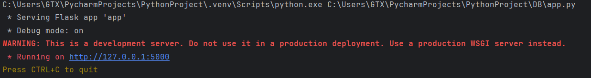

## POST users:

	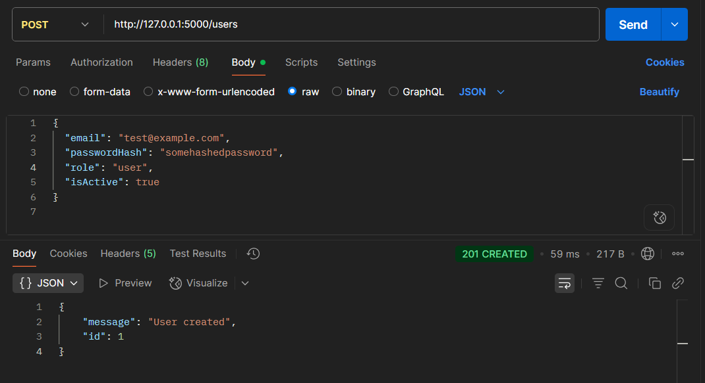

## GET users:

	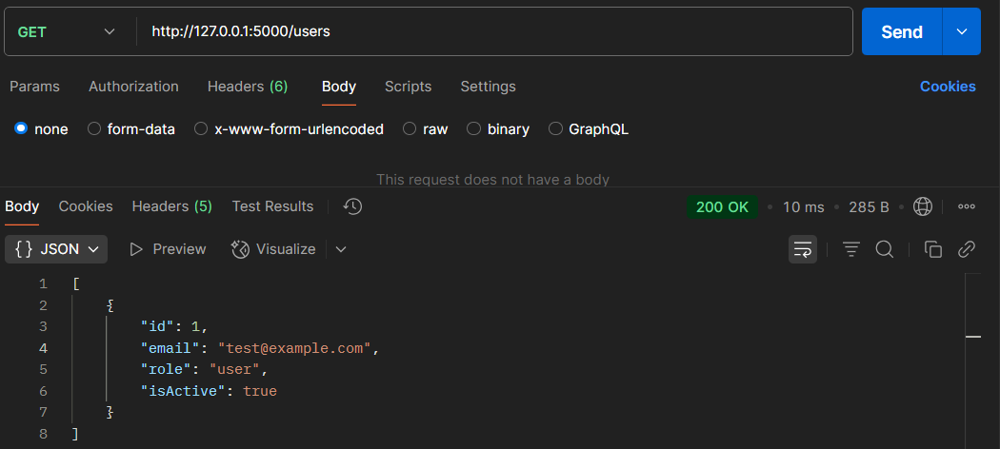

## GET users/1:

	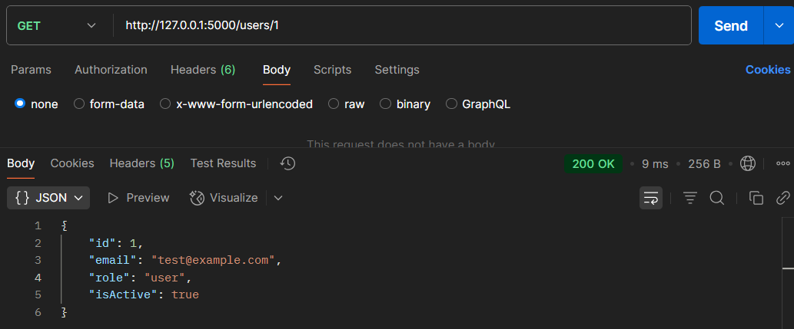

## DELETE users/1:

	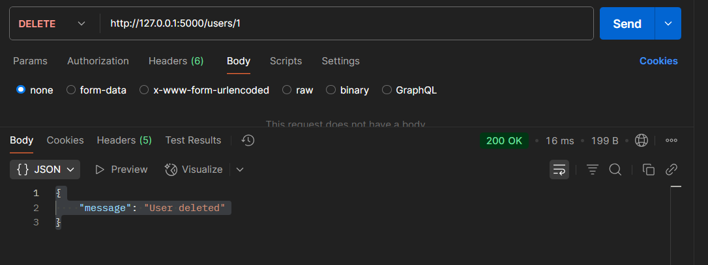

## POST survey-links:

	

## GET survey-links:

	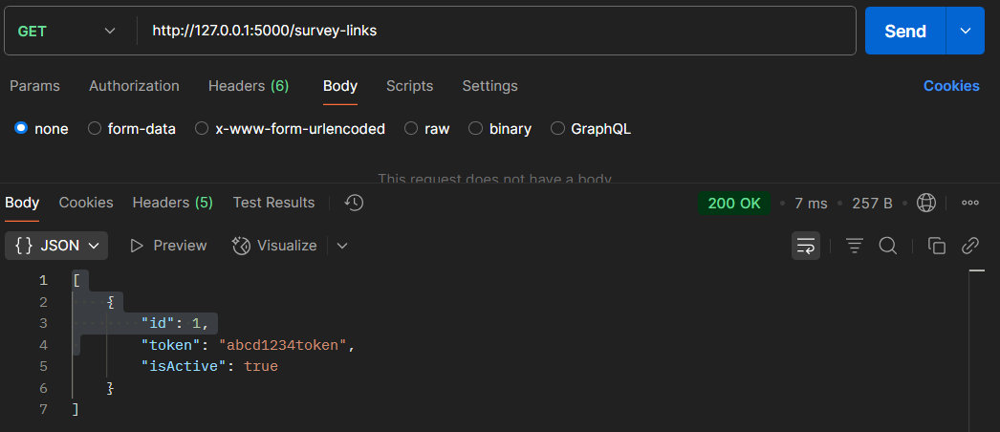

## GET survey-links/1:

	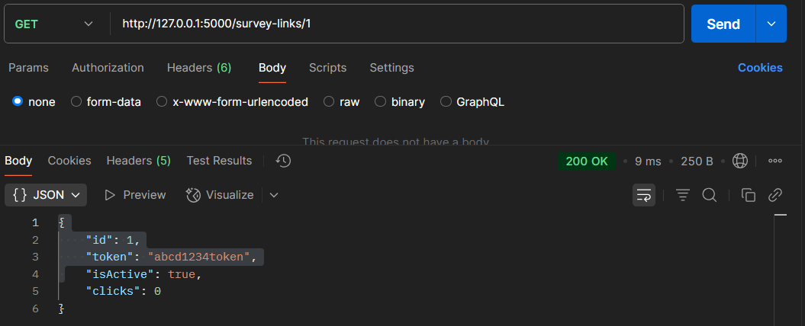

## DELETE survey-links/1:

	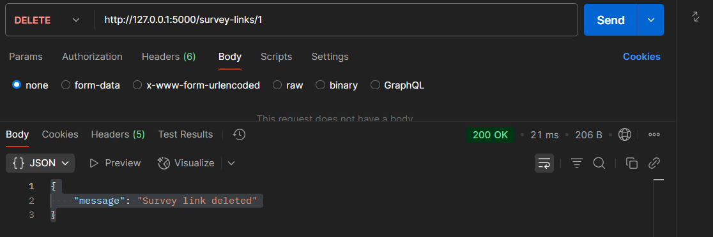

## POST surveys:

	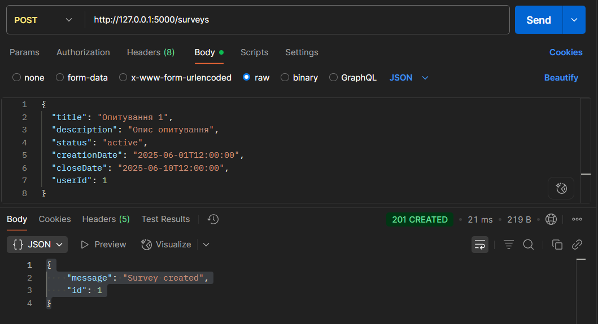

## GET surveys:

	

## GET surveys/1:

	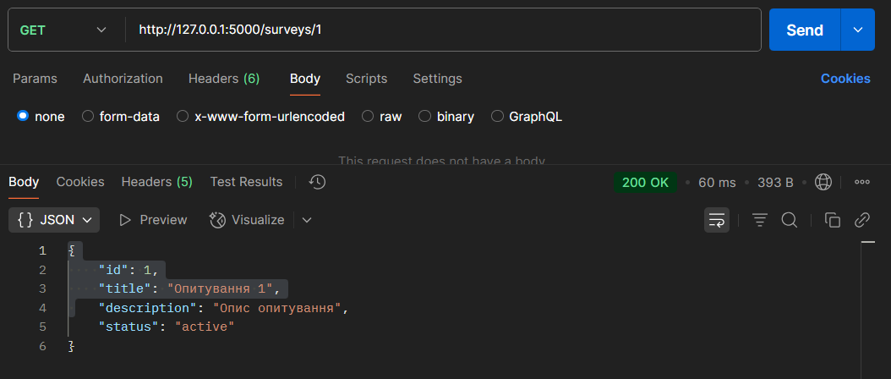

## DELETE surveys/1:

	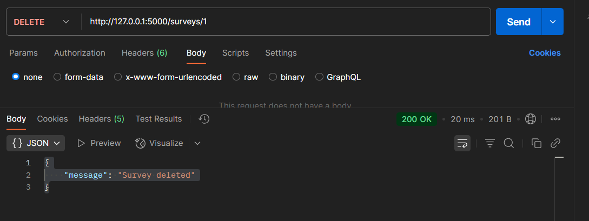

## POST responses:

	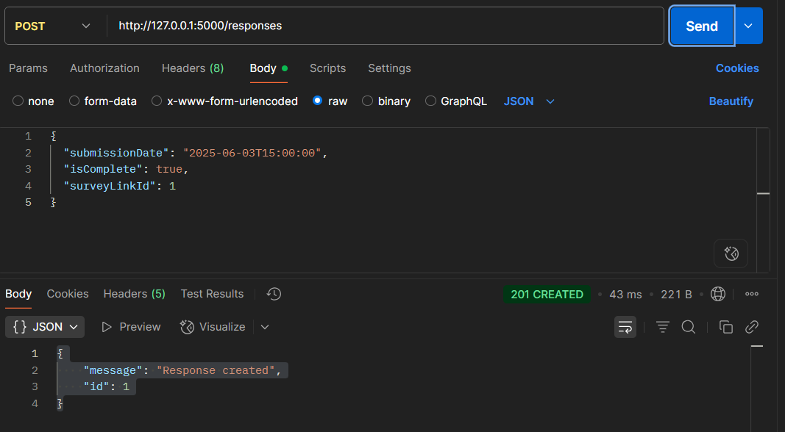

## GET responses:

	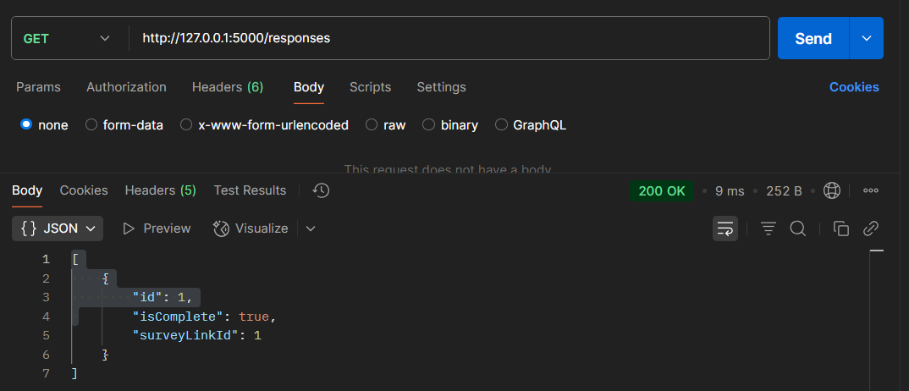

## GET responses/1:

	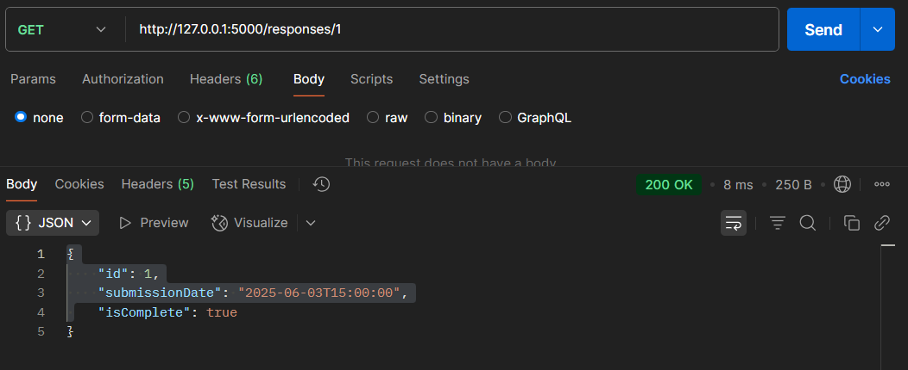

## DELETE responses/1:

	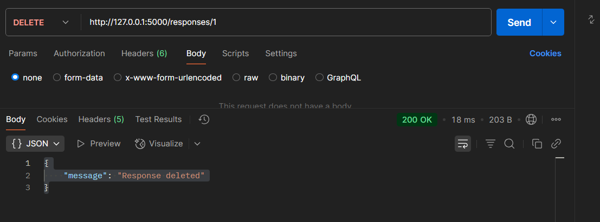

## POST questions:

	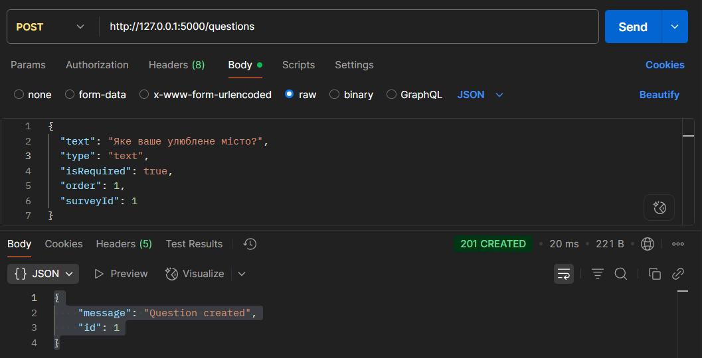

## GET questions:

	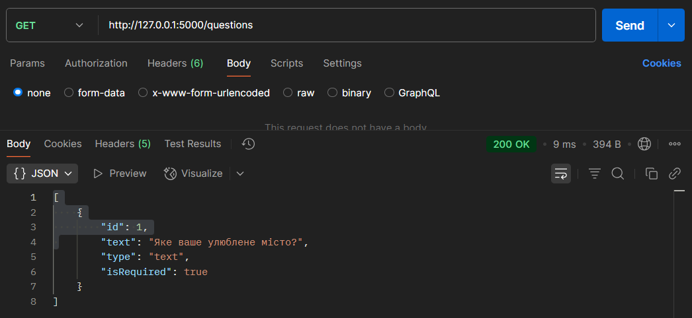

## GET questions/1:

	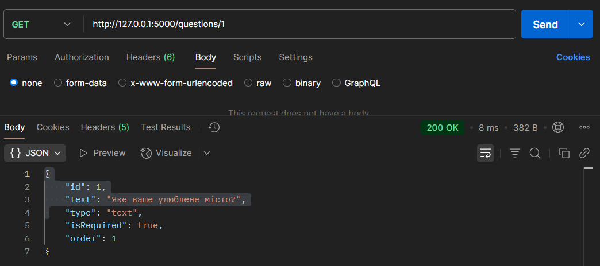

## DELETE questions/1:

	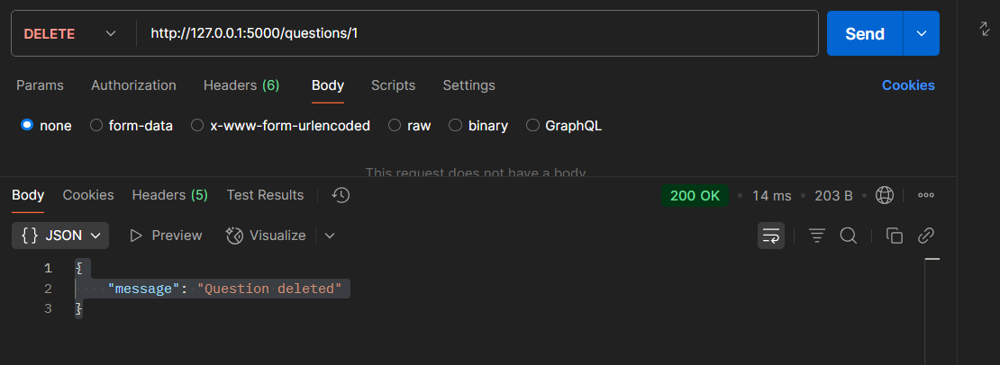

## POST answers:

	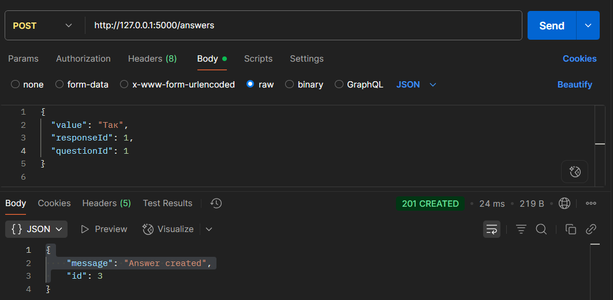

## GET answers:

	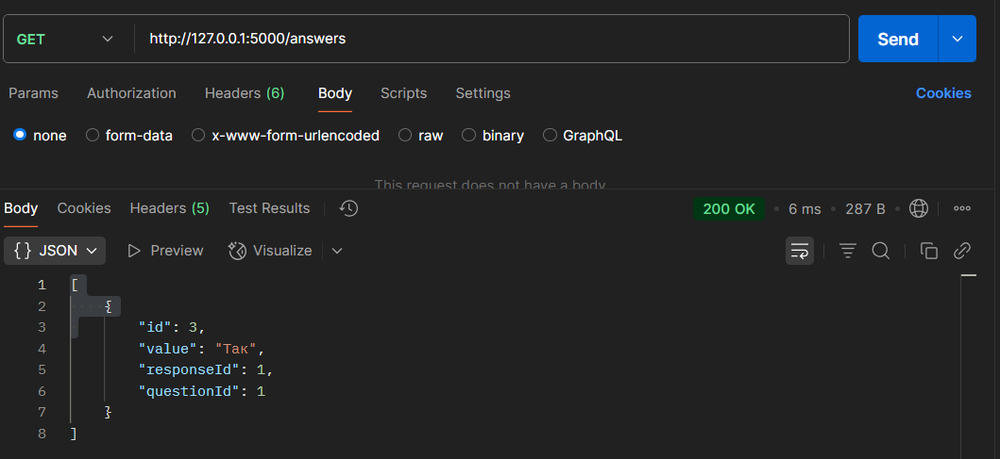

## GET answers/3:

	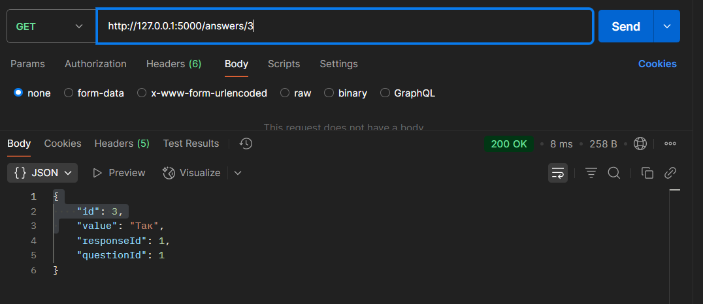

## DELETE answers/3:

	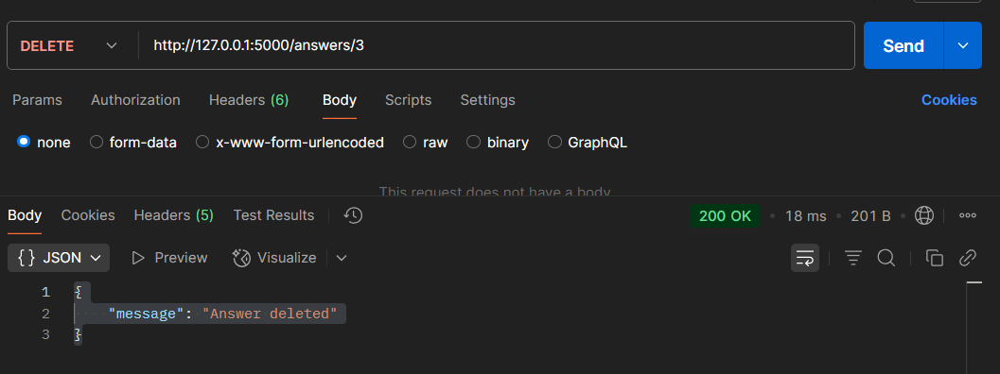

