# Тестування працездатності системи

Тестування сервісу виконувалось шляхом надсилання HTTP-запитів за допомогою Swagger UI.

## Отримання всіх користувачів системи (GET /api/v1/users)

	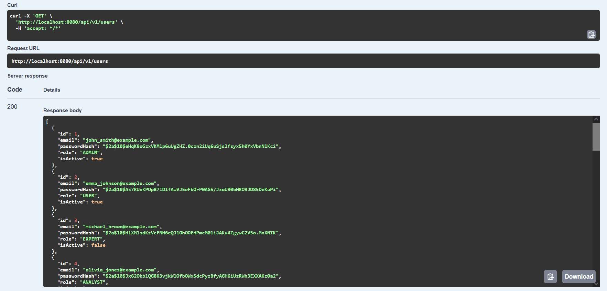

## Отримання користувача за ID (GET /api/v1/users/{id})

	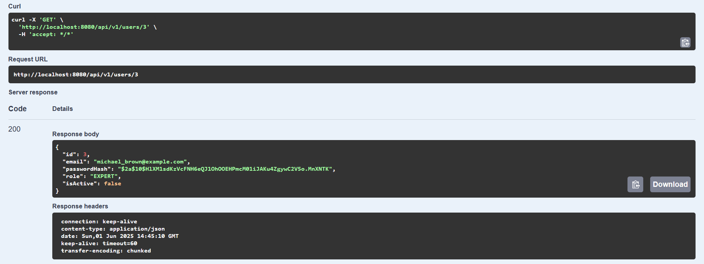

	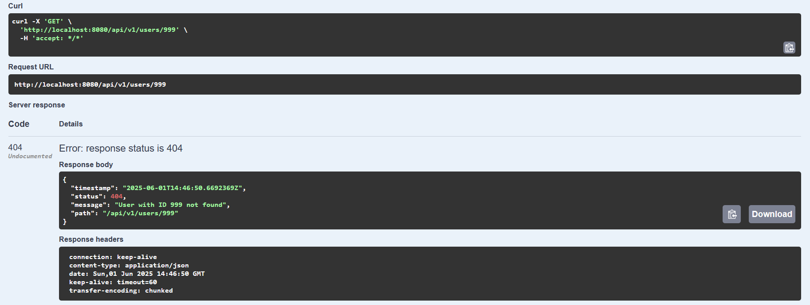

## Створення користувача (POST /api/v1/users)

	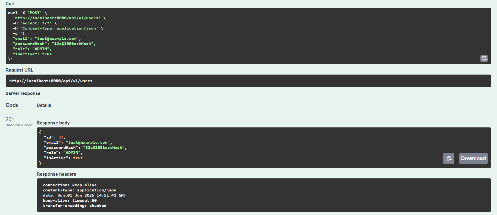

	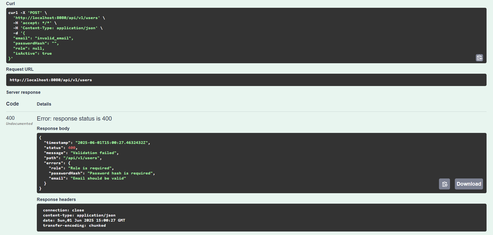

	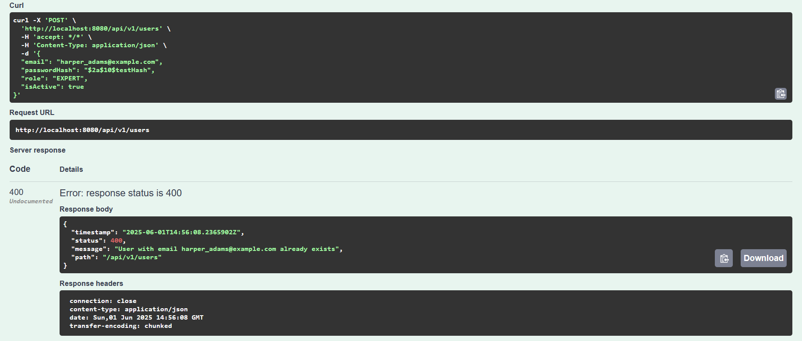

## Оновлення користувача за ID (PUT /api/v1/users/{id})

	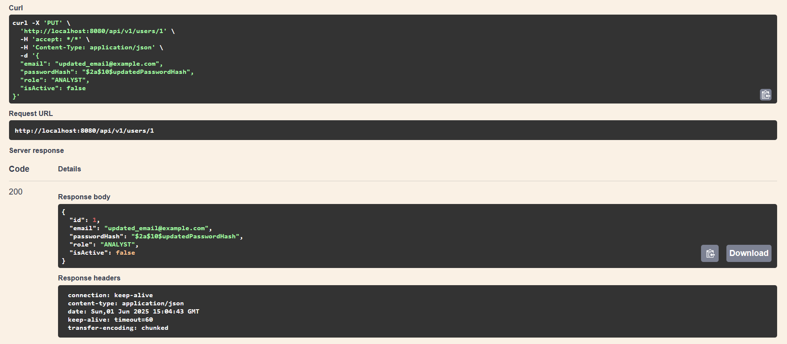

	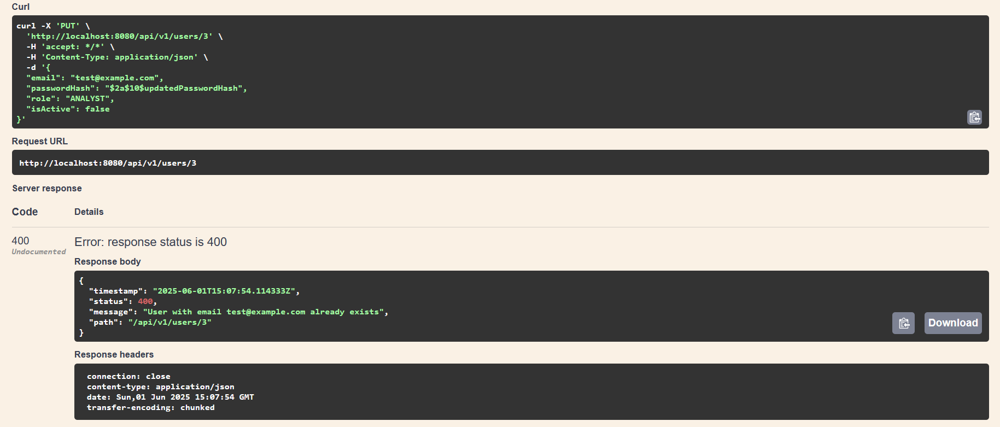

	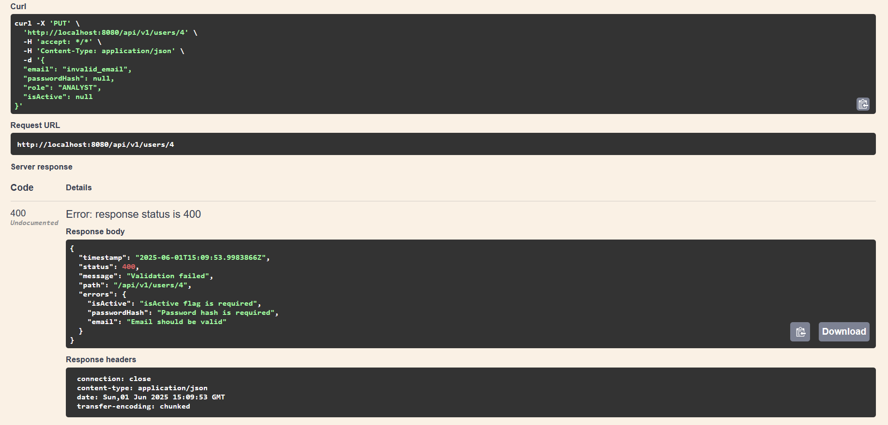

## Видалення  користувача за ID (DELETE /api/v1/users/{id})

	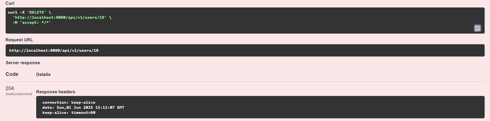

	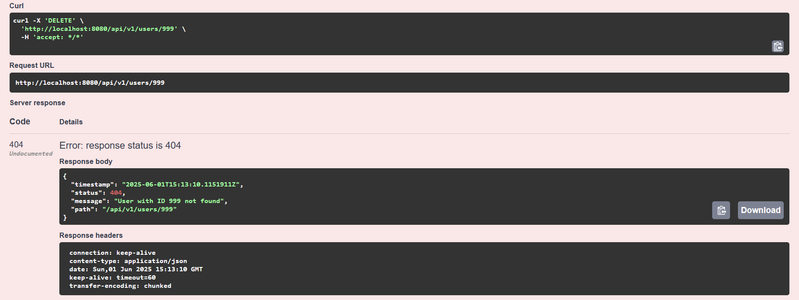

## Таблиця app_user із бази даних survey_db

	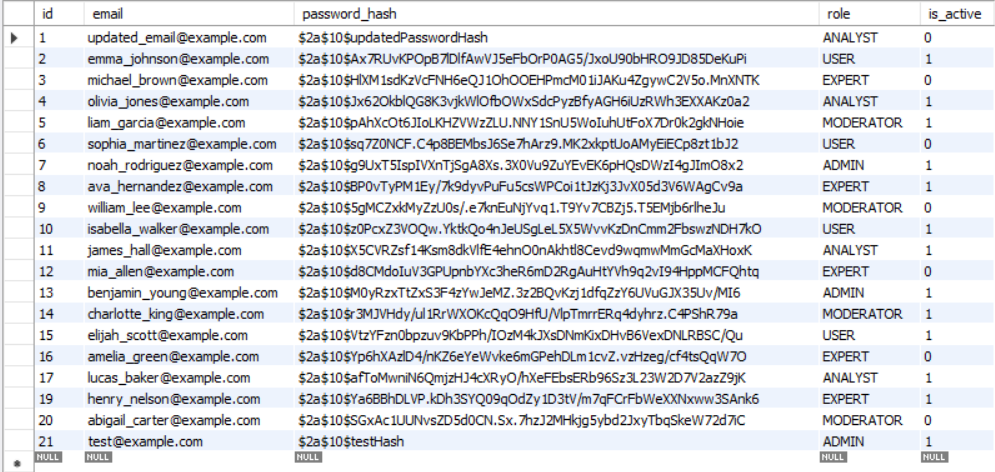

