## Загальна схема

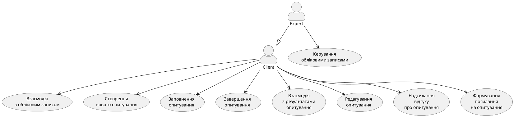

## Схема клієнта

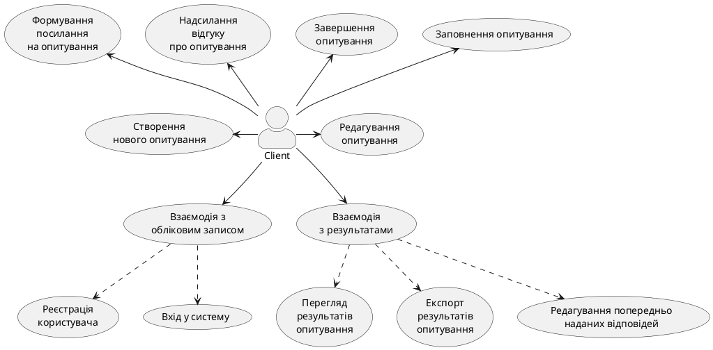

## Схема експерта
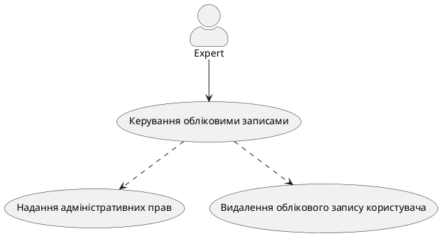

# Сценарії використання

## UserRegistration

| ID                      | Назва                                   | Учасники          | Передумови                                 | Результат                                     | Виключні ситуації                          | Основний сценарій |
|-------------------------|-----------------------------------------|-------------------|--------------------------------------------|----------------------------------------------|--------------------------------------------|------------------------------------------------------------------------------------------------------------------------------------------------------------------------|
| UserRegistration       | Реєстрація нового користувача          | Користувач, система | Користувач не має облікового запису в системі | Система створює новий обліковий запис і зберігає реєстраційні дані користувача | Некоректні дані – InvalidDataException Користувач уже зареєстрований – AlreadyRegisteredException | 1. Користувач відкриває сторінку реєстрації. 2. Вносить необхідні дані. 3. Система перевіряє введену інформацію. 4. Система створює обліковий запис. 5. Користувач отримує повідомлення. |

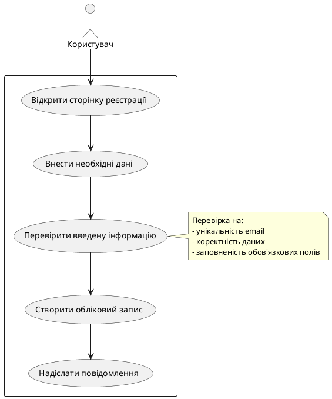

## UserLogin
| ID                      | Назва                                   | Учасники          | Передумови                                 | Результат                                     | Виключні ситуації                          | Основний сценарій |
|-------------------------|-----------------------------------------|-------------------|--------------------------------------------|----------------------------------------------|--------------------------------------------|------------------------------------------------------------------------------------------------------------------------------------------------------------------------|
| UserLogin             | Вхід у систему                          | Користувач, система | Користувач уже має обліковий запис | Користувач успішно входить до системи | Некоректні дані – InvalidDataException | 1. Користувач вводить логін та пароль. 2. Система перевіряє правильність. 3. Користувач отримує доступ. |

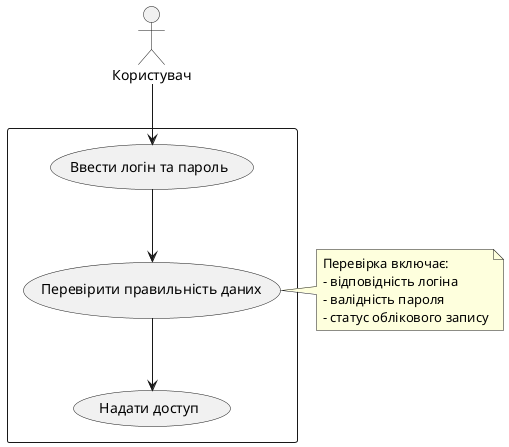

## SurveyCreate
| ID                      | Назва                                   | Учасники          | Передумови                                 | Результат                                     | Виключні ситуації                          | Основний сценарій |
|-------------------------|-----------------------------------------|-------------------|--------------------------------------------|----------------------------------------------|--------------------------------------------|------------------------------------------------------------------------------------------------------------------------------------------------------------------------|
| SurveyCreate          | Створення нового опитування             | Користувач, система | Користувач має обліковий запис і права | Опитування успішно збережено | Порожнє опитування – EmptySurveyException | 1. Користувач заповнює форму. 2. Система перевіряє дані. 3. Опитування збережено. |

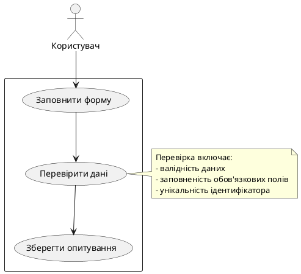

## UserCompletesSurvey
| ID                      | Назва                                   | Учасники          | Передумови                                 | Результат                                     | Виключні ситуації                          | Основний сценарій |
|-------------------------|-----------------------------------------|-------------------|--------------------------------------------|----------------------------------------------|--------------------------------------------|------------------------------------------------------------------------------------------------------------------------------------------------------------------------|
| UserCompletesSurvey   | Заповнення опитування                   | Користувач, система | Користувач має доступ до опитування | Відповіді збережені | Пропущені обов’язкові питання – IncompleteSurveyException | 1. Користувач відкриває анкету. 2. Заповнює відповіді. 3. Система перевіряє та зберігає. |

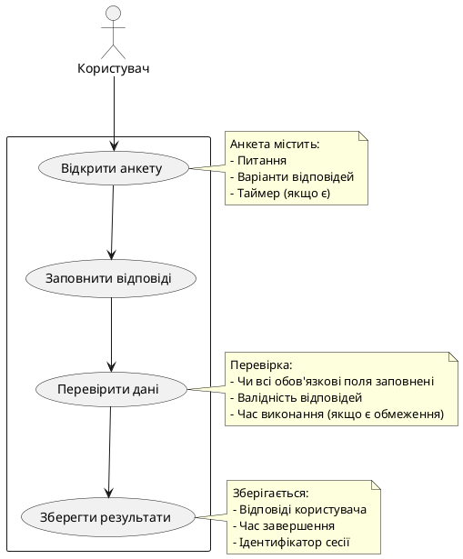

## UserEditResponses
| ID                      | Назва                                   | Учасники          | Передумови                                 | Результат                                     | Виключні ситуації                          | Основний сценарій |
|-------------------------|-----------------------------------------|-------------------|--------------------------------------------|----------------------------------------------|--------------------------------------------|------------------------------------------------------------------------------------------------------------------------------------------------------------------------|
| UserEditResponses     | Редагування відповідей                  | Користувач, система | Користувач пройшов опитування | Відредаговані відповіді збережені | Некоректні дані – InvalidResponseException Опитування закрите – SurveyClosedException | 1. Користувач редагує відповіді. 2. Система перевіряє коректність. 3. Зміни збережені. |

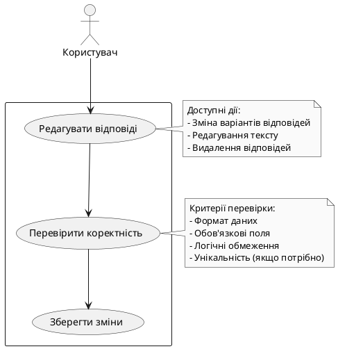

## SurveyResultsView
| ID                      | Назва                                   | Учасники          | Передумови                                 | Результат                                     | Виключні ситуації                          | Основний сценарій |
|-------------------------|-----------------------------------------|-------------------|--------------------------------------------|----------------------------------------------|--------------------------------------------|------------------------------------------------------------------------------------------------------------------------------------------------------------------------|
| SurveyResultsView     | Перегляд відповідей                     | Користувач, система | Опитування завершене | Звіт сформований | Відсутність достатньої кількості відповідей | 1. Користувач відкриває результати. 2. Система обробляє дані. 3. Формується звіт. |

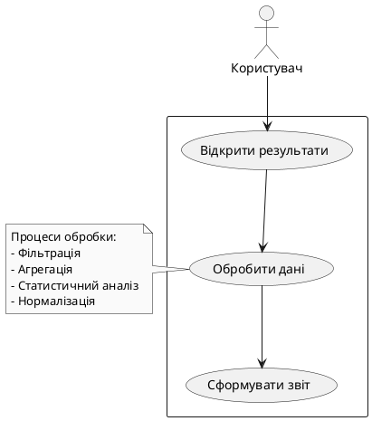

## SurveyResultsExport
| ID                      | Назва                                   | Учасники          | Передумови                                 | Результат                                     | Виключні ситуації                          | Основний сценарій |
|-------------------------|-----------------------------------------|-------------------|--------------------------------------------|----------------------------------------------|--------------------------------------------|------------------------------------------------------------------------------------------------------------------------------------------------------------------------|
| SurveyResultsExport   | Експорт результатів                     | Користувач, система | Опитування завершене | Користувач отримує файл | Некоректний формат – UnsupportedFormatException | 1. Користувач обирає формат. 2. Система генерує файл. 3. Користувач отримує його. |

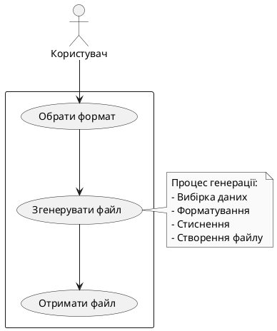
## SurveyUpdate
| ID                      | Назва                                   | Учасники          | Передумови                                 | Результат                                     | Виключні ситуації                          | Основний сценарій |
|-------------------------|-----------------------------------------|-------------------|--------------------------------------------|----------------------------------------------|--------------------------------------------|------------------------------------------------------------------------------------------------------------------------------------------------------------------------|
| SurveyUpdate         | Оновлення опитування                     | Користувач, система | Опитування не завершене | Опитування оновлене | Опитування вже активне – зміни неможливі | 1. Користувач редагує опитування. 2. Система зберігає зміни. |

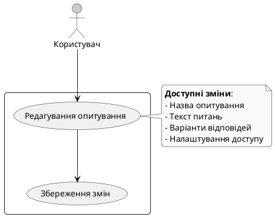
## SurveyFeedback
| ID                      | Назва                                   | Учасники          | Передумови                                 | Результат                                     | Виключні ситуації                          | Основний сценарій |
|-------------------------|-----------------------------------------|-------------------|--------------------------------------------|----------------------------------------------|--------------------------------------------|------------------------------------------------------------------------------------------------------------------------------------------------------------------------|
| SurveyFeedback       | Надання відгуку                         | Користувач, система | Користувач пройшов опитування | Відгук збережений | Технічні проблеми – FeedbackSaveError | 1. Користувач залишає відгук. 2. Система зберігає його. |

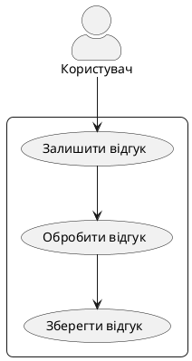

## SurveyShareAccess
| ID                      | Назва                                   | Учасники          | Передумови                                 | Результат                                     | Виключні ситуації                          | Основний сценарій |
|-------------------------|-----------------------------------------|-------------------|--------------------------------------------|----------------------------------------------|--------------------------------------------|------------------------------------------------------------------------------------------------------------------------------------------------------------------------|
| SurveyShareAccess    | Надання доступу                         | Користувач, система | Користувач – автор опитування | Доступ наданий | Немає прав на надання доступу | 1. Користувач отримує посилання для спільного доступу. 2. Передає його іншим користувачам. |

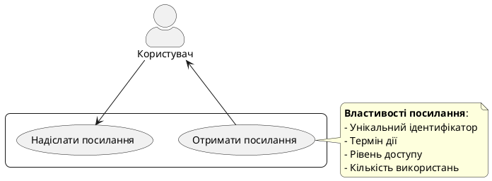

## SurveyReminder
| ID                      | Назва                                   | Учасники          | Передумови                                 | Результат                                     | Виключні ситуації                          | Основний сценарій |
|-------------------------|-----------------------------------------|-------------------|--------------------------------------------|----------------------------------------------|--------------------------------------------|------------------------------------------------------------------------------------------------------------------------------------------------------------------------|
| SurveyReminder       | Нагадування про опитування              | Користувач, система | Є активне опитування | Користувач отримує нагадування | Немає активних опитувань – NoPendingSurveysException | 1. Система перевіряє стан опитувань. 2. Надсилає нагадування користувачу. |

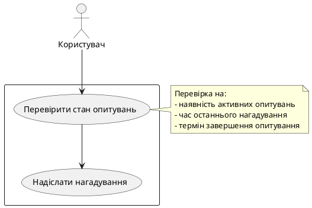

## SurveyStatsCollection
| ID                      | Назва                                   | Учасники          | Передумови                                 | Результат                                     | Виключні ситуації                          | Основний сценарій |
|-------------------------|-----------------------------------------|-------------------|--------------------------------------------|----------------------------------------------|--------------------------------------------|------------------------------------------------------------------------------------------------------------------------------------------------------------------------|
| SurveyStatsCollection| Збір статистики                         | Адміністратор, система | Адміністратор хоче переглянути статистику | Генерується звіт | Дані недоступні – DataNotAvailableException | 1. Адміністратор відкриває статистику. 2. Система формує звіт. |

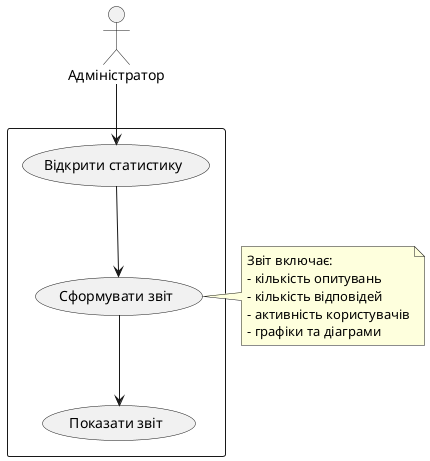

## SurveyClose
| ID                      | Назва                                   | Учасники          | Передумови                                 | Результат                                     | Виключні ситуації                          | Основний сценарій |
|-------------------------|-----------------------------------------|-------------------|--------------------------------------------|----------------------------------------------|--------------------------------------------|------------------------------------------------------------------------------------------------------------------------------------------------------------------------|
| SurveyClose         | Завершення опитування                    | Користувач, система | Опитування неактивне або завершене | Доступ закритий | Опитування ще активне – CloseNotAllowedException | 1. Користувач завершує опитування. 2. Система закриває доступ. |

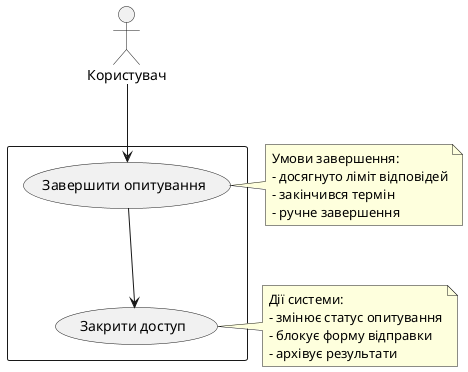

## SurveyInvitationSend
| ID                      | Назва                                   | Учасники          | Передумови                                 | Результат                                     | Виключні ситуації                          | Основний сценарій |
|-------------------------|-----------------------------------------|-------------------|--------------------------------------------|----------------------------------------------|--------------------------------------------|------------------------------------------------------------------------------------------------------------------------------------------------------------------------|
| SurveyInvitationSend | Надсилання запрошення                    | Користувач, система | Користувач створив опитування | Запрошення надіслано | Помилка відправки – EmailSendException | 1. Користувач вводить e-mail. 2. Система надсилає запрошення. |

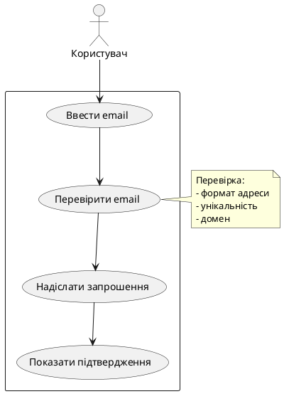

## AdminRightsGrant
| ID                      | Назва                                   | Учасники          | Передумови                                 | Результат                                     | Виключні ситуації                          | Основний сценарій |
|-------------------------|-----------------------------------------|-------------------|--------------------------------------------|----------------------------------------------|--------------------------------------------|------------------------------------------------------------------------------------------------------------------------------------------------------------------------|
| AdminRightsGrant    | Надання адміністративних прав            | Адміністратор, система | Користувач не є адміністратором | Користувач отримує права | Користувач вже адміністратор – UserAlreadyAdminException | 1. Адміністратор надає права користувачу. 2. Система підтверджує зміни. |

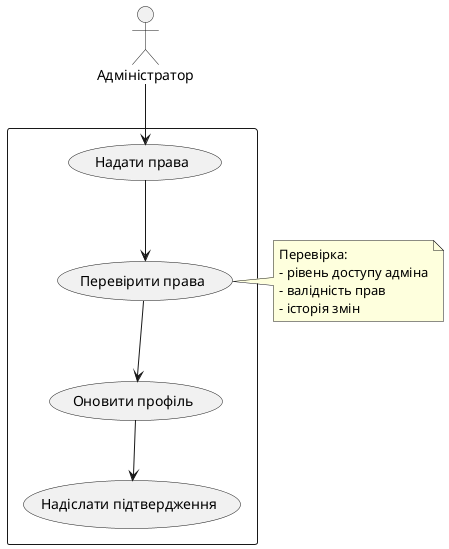

