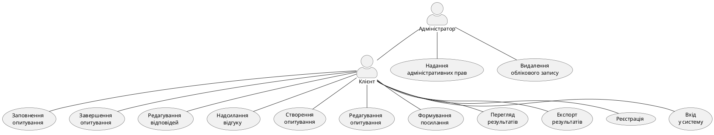

## Загальна схема

```plantuml
@startuml

@startuml
skinparam actorStyle awesome
skinparam defaultTextAlignment center
skinparam layoutDirection topToBottom

actor Клієнт
actor Адміністратор

Клієнт -- (UC4)
usecase UC4 as "Заповнення\nопитування"

Клієнт -- (UC5)
usecase UC5 as "Завершення\nопитування"

Клієнт -- (UC7)
usecase UC7 as "Редагування\nвідповідей"

Клієнт -- (UC10)
usecase UC10 as "Надсилання\nвідгуку"

Клієнт -- (UC3)
usecase UC3 as "Створення\nопитування"

Клієнт -- (UC8)
usecase UC8 as "Редагування\nопитування"

Клієнт -- (UC11)
usecase UC11 as "Формування\nпосилання"

Клієнт -- (UC6)
usecase UC6 as "Перегляд\nрезультатів"

Клієнт -- (UC9)
usecase UC9 as "Експорт\nрезультатів"

Клієнт -- (UC1)
usecase UC1 as "Реєстрація"

Клієнт -- (UC2)
usecase UC2 as "Вхід\nу систему"

Адміністратор -- (UC12)
usecase UC12 as "Надання\nадміністративних прав"

Адміністратор -- (UC13)
usecase UC13 as "Видалення\nоблікового запису"

Адміністратор -- Клієнт

@enduml

```
