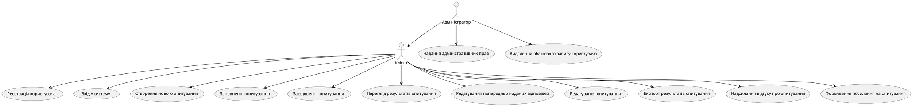

## Загальна схема

```plantuml
@startuml

actor Клієнт
actor Адміністратор

usecase "Реєстрація користувача" as UC1
usecase "Вхід у систему" as UC2
usecase "Створення нового опитування" as UC3
usecase "Заповнення опитування" as UC4
usecase "Завершення опитування" as UC5
usecase "Перегляд результатів опитування" as UC6
usecase "Редагування попередньо наданих відповідей" as UC7
usecase "Редагування опитування" as UC8
usecase "Експорт результатів опитування" as UC9
usecase "Надсилання відгуку про опитування" as UC10
usecase "Формування посилання на опитування" as UC11
    
usecase "Надання адміністративних прав" as UC12
usecase "Видалення облікового запису користувача" as UC13

Клієнт --> UC1
Клієнт --> UC2
Клієнт --> UC3
Клієнт --> UC4
Клієнт --> UC5
Клієнт --> UC6
Клієнт --> UC7
Клієнт --> UC8
Клієнт --> UC9
Клієнт --> UC10
Клієнт --> UC11

Адміністратор --> Клієнт
Адміністратор --> UC12
Адміністратор --> UC13
@enduml
```
