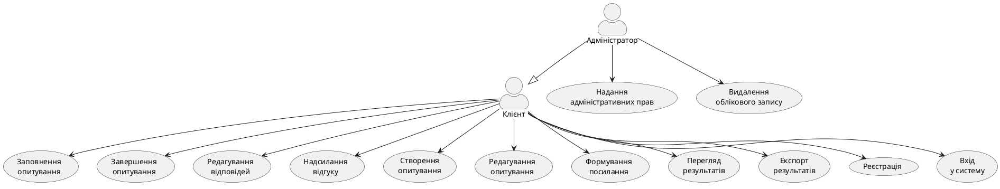
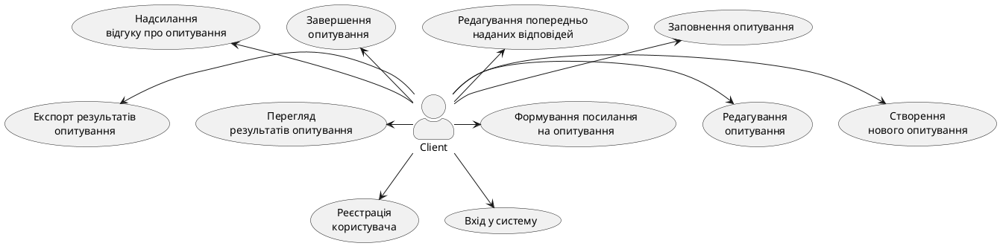

## Загальна схема

```plantuml
@startuml
skinparam actorStyle awesome
skinparam defaultTextAlignment center
skinparam layoutDirection topToBottom
actor Клієнт
actor Адміністратор
Клієнт --> (UC4)
usecase UC4 as "Заповнення\nопитування"
Клієнт --> (UC5)
usecase UC5 as "Завершення\nопитування"
Клієнт --> (UC7)
usecase UC7 as "Редагування\nвідповідей"
Клієнт --> (UC10)
usecase UC10 as "Надсилання\nвідгуку"
Клієнт --> (UC3)
usecase UC3 as "Створення\nопитування"
Клієнт --> (UC8)
usecase UC8 as "Редагування\nопитування"
Клієнт --> (UC11)
usecase UC11 as "Формування\nпосилання"
Клієнт --> (UC6)
usecase UC6 as "Перегляд\nрезультатів"
Клієнт --> (UC9)
usecase UC9 as "Експорт\nрезультатів"
Клієнт --> (UC1)
usecase UC1 as "Реєстрація"
Клієнт --> (UC2)
usecase UC2 as "Вхід\nу систему"
Адміністратор --> (UC12)
usecase UC12 as "Надання\nадміністративних прав"
Адміністратор --> (UC13)
usecase UC13 as "Видалення\nоблікового запису"
Адміністратор -d-|> Клієнт
@enduml
```

## Схема клієнта

```plantuml
@startuml
skinparam actorStyle awesome
actor Client
(Client) -down-> (UserReg)
(Client) -down-> (UserLogin)
(Client) -right-> (CreateNewSurvey)
(Client) -right-> (EditSurvey)
(Client) -right-> (CreateLinkToSurvey)
(Client) -up-> (FillNewSurvey)
(Client) -up-> (EditPrevAnswers)
(Client) -up-> (EndSurvey)
(Client) -up-> (SendSurveyFeedback)
(Client) -left-> (CheckSurveyRes)
(Client) -left-> (ExportSurveyRes)
(UserReg) as "Реєстрація\nкористувача"
(UserLogin) as "Вхід у систему"
(CreateNewSurvey) as "Створення\nнового опитування"
(EditSurvey) as "Редагування\nопитування"
(CreateLinkToSurvey) as "Формування посилання\nна опитування"
(FillNewSurvey) as "Заповнення опитування"
(EditPrevAnswers) as "Редагування попередньо\nнаданих відповідей"
(EndSurvey) as "Завершення\nопитування"
(SendSurveyFeedback) as "Надсилання\nвідгуку про опитування"
(CheckSurveyRes) as "Перегляд\nрезультатів опитування"
(ExportSurveyRes) as "Експорт результатів\nопитування"
@enduml
```

## Схема експерта

